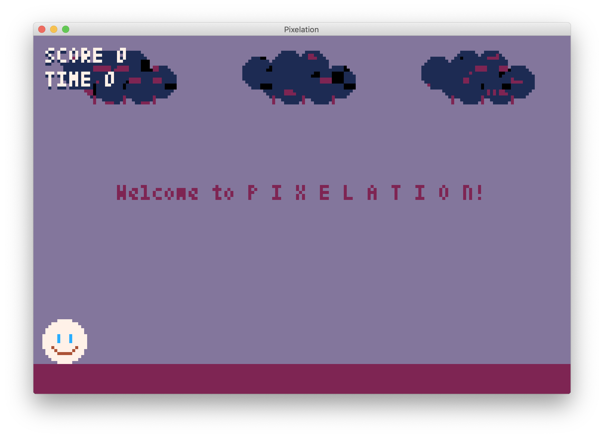

# P I X E L A T I O N



This is a simple retro-style game where you have a hero which roams around
and tries to avoid getting hit by raging clouds. If you get hit by the cloud,
your score goes down, however, if you actually manage to hit the cloud
with the laser beam, you will get awarded with points. Be sure to time the laser
beam properly since there is a short delay before being able to reuse it again.

Note that everything in the game is built manually using pixels. Therefore,
every tiny particle has its own coordinates and could be manipulated directly.
This flexibility, however, comes with the price which is hard work for calculating
various measures of moving objects such as the width of cloud.

The game is implemented using retro game engine for Python called Pyxel.
For more information, see https://github.com/kitao/pyxel

## Running The Game

You will need to install (if not installed) **Python 3**, **Pyxel**, and, depending
on the operating system, some other additional libraries.

### Windows

```sh
$ pip install pyxel==0.8.0
$ git clone https://github.com/oniani/pixelation.git
$ cd pixelation
$ python3 pixelation.py
```

### macOS

```sh
$ brew install python3 sdl2 sdl2_image
$ pip3 install pyxel==0.8.0
$ git clone https://github.com/oniani/pixelation.git
$ cd pixelation
$ python3 pixelation.py
```

### Ubuntu / Debian

```sh
$ sudo apt install python3 python3-pip libsdl2-dev libsdl2-image-dev
$ sudo pip3 install pyxel==0.8.0
$ git clone https://github.com/oniani/pixelation.git
$ cd pixelation
$ python3 pixelation.py
```

## Controls

| Key           | Action                |
| ------------- | --------------------- |
| `Enter`       | Start The Game        |
| `P`           | Pause/Resume The Game |
| `Q`           | Quit The Game         |
| `Space`       | Shoot The Laser Beam  |
| `Up Arrow`    | Jump                  |
| `Left Arrow`  | Move Left             |
| `Right Arrow` | Move Right            |
| `W`           | Jump                  |
| `A`           | Move Left             |
| `D`           | Move Right            |

## License

[GNU General Public License v3.0](LICENSE)
